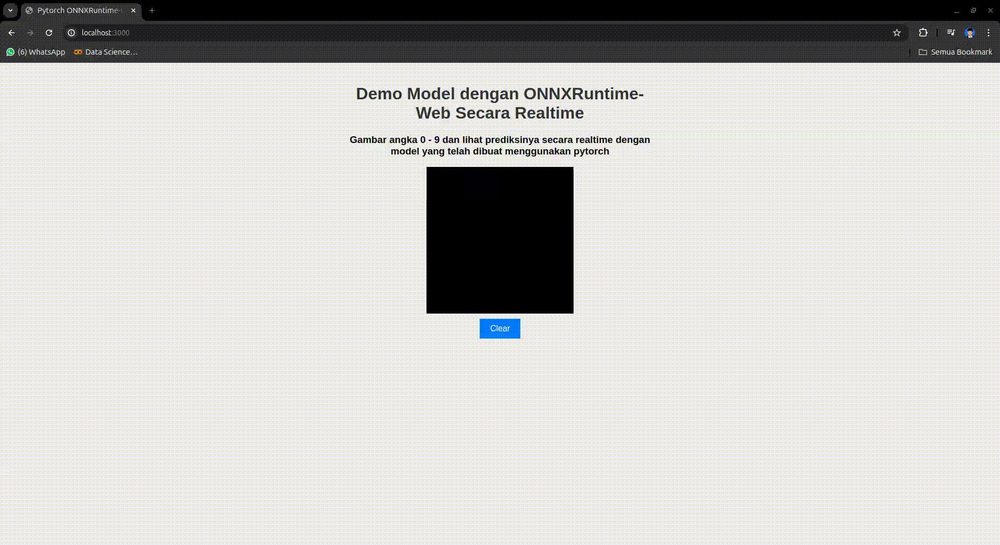
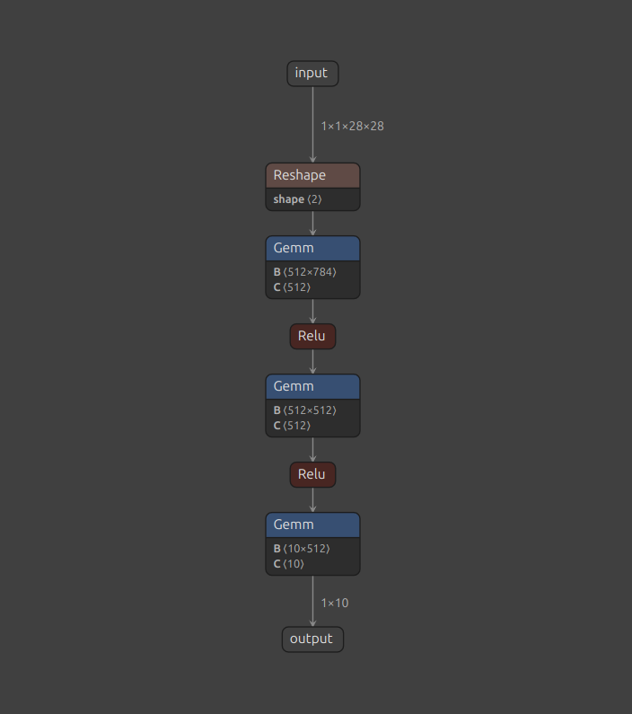

# Example Pytorch Model to ONNXRuntime-Web

Proyek ini bertujuan untuk melatih model deep learning menggunakan dataset MNIST untuk mengenali angka tulisan tangan. Model akan diekspor ke format ONNX untuk integrasi web sederhana yang kita gambar sendiri di canvas dan menampilkan hasil prediksi nya dengan model yang telah dibuat

## Demo Project


Pada demo diatas kita bisa melihat saat kita menggambar di canvas langsung menampilkan hasil prediksi berdasarkan model yang telah kita latih

## Arsiteksur Model Sederhana


## Build Model

Clone project

```bash
  git clone https://github.com/naufalahnaf17/example-torch-onnx.git
```

Masuk ke direktori model dan aktifkan Virtual ENV

```bash
    cd model
    python -m venv env
    source env/bin/activate
```

Install requirements.txt dan Training model

```bash
    pip install -r requirements.txt
    python main.py
```

### Apa saja yang bisa diganti pada proses training ?
- `num_epochs = 10 (default)`
- `criterion = CrossEntropyLoss`
- `optimizer = Adam`
- `learning rate = 1e-3 / 0.003`

### Output Folder
- /data `(MNIST Dataset)`
- /env `Virtual Env`
- /output `(model.pth dan model.onnx)`

### Akurasi Training
98% Akurasi


## Build ONNXRuntime-Web 

Masuk ke direktori web dan jalankan 

```bash
    cd web
    npx serve
```

atau kalian juga bisa langsung buka index.html di browser kalian
jangan lupa pindahkan model/output/mnist_model.onnx hasil training ke folder web/model (buat folder seperti ini)


## Authors

- [@naufalahnaf17](https://github.com/naufalahnaf17)

## License

[MIT](https://choosealicense.com/licenses/mit/)


